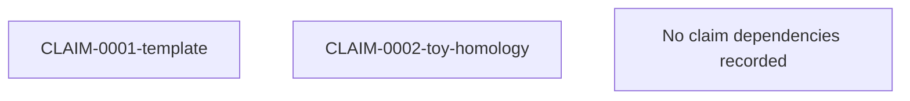

# Claim Graph

Generated by `python scripts/make_index.py`.

```mermaid
graph TD
  CLAIM_0001_template["CLAIM-0001-template"]
  CLAIM_0002_toy_homology["CLAIM-0002-toy-homology"]
  empty["No claim dependencies recorded"]
```
